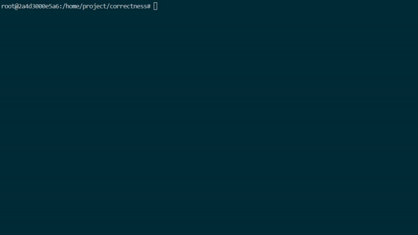
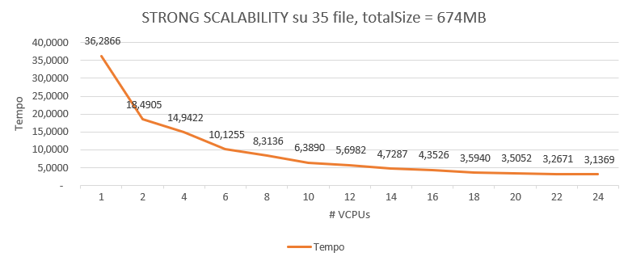
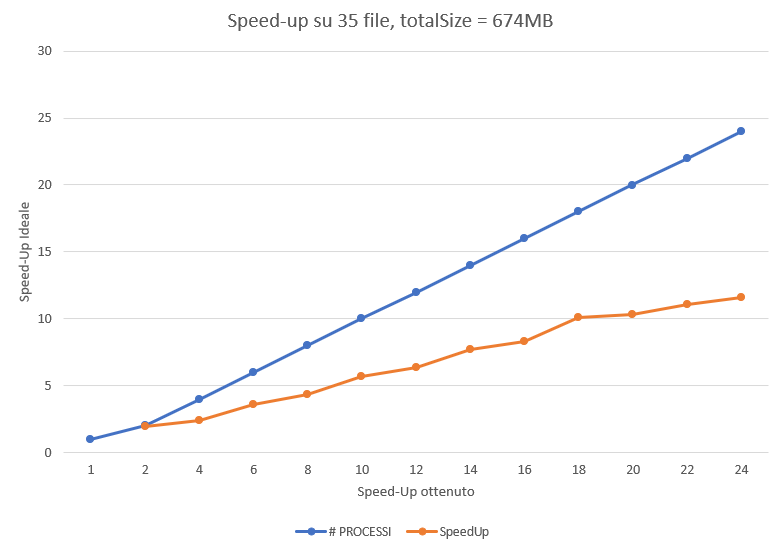
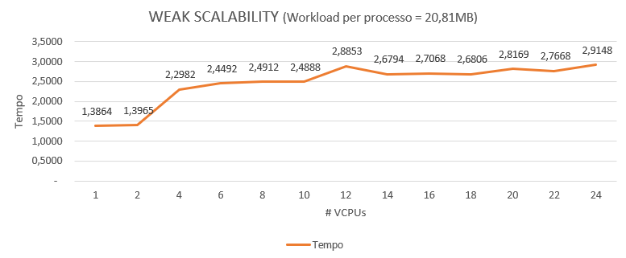

# Word-Count-MPI
A parallel implementation of a word counter using OpenMPI.
## Info sul progetto
Nome: *Simone* <br />
Cognome: *Giglio* <br />
Matricola: *0522501292* <br />
Benchmark tramite Google Cloud: **6** *istanze*, **4** *vCPUs* e **16** GBs di memoria (*e2-standard-4*) <br />
# Indice
* [Introduzione al problema](#Introduzione-al-problema)
* [Approccio alla soluzione](#Approccio-alla-soluzione)
* [Dettagli sull'implementazione](#Dettagli-sull'implementazione)
* [Come eseguire il codice](#Come-eseguire-il-codice)
* [Correttezza](#Correttezza)
* [Benchmarks](#benchmarks)
* [Conclusioni](#conclusioni)

# Introduzione al problema


Il problema del Word Count riguarda il conteggio del numero di parole in un documento o in un file di testo generico. L'utilizzo del Word Counter può essere necessario quando un testo deve rimanere entro un determinato numero di parole come ad esempio: nel caso del mondo accademico, nei procedimenti legali, nell'ambito giornalistico o pubblicitario; può essere anche utilizzato dai traduttori per determinare il prezzo di un lavoro di traduzione. <br />
E' stata fatta una semplice implementazione del Word Count in MPI durante il corso di *"Programmazione Concorrente e Parallela sul Cloud" (PCPC - 0522500102)* all'Università degli studi di Salerno. <br /> <br />
L'obiettivo di questo progetto riguarda la creazione di un applicativo che realizzi il conteggio delle parole in modo parallelo tra più processi usando la libreria OpenMPI.
Viene utilizzata questa implementazione per eseguire il conteggio delle parole su un gran numero di file; introduciamo il problema dividendolo in varie fasi:
1. Il processo MASTER avrà l'elenco di tutti i file da leggere all'interno di una directory. E' importante specificare che solo 1 dei processi leggerà l'elenco dei file. Quindi ciascuno dei processi riceverà la propria "parte" del file dal processo MASTER. Dopo che un processo ha ricevuto il suo elenco di file da elaborare, effettuerà quindi la lettura di ciascuno dei file per poi eseguire il conteggio delle parole, tenendo traccia ovviamente della frequenza con cui si verifica ogni parola trovata nei file. Chiameremo l'istogramma prodotto *l'istogramma locale*.
2. La seconda fase consiste nella produzione dell'istogramma locale che permetterà di combinare le frequenze delle parole per ogni processo. Ad esempio, la parola "ciao" potrebbe essere contata più volte in processi diversi, quindi alla fine si sommeranno tutte queste occorrenze.
3. L'ultima fase prevede che ciascuno dei processi invii i propri istogrammi locali al processo MASTER, che avrà solo bisogno di raccogliere tutte queste informazioni. Ovviamente ci saranno parole duplicate tra i processi, quindi il MASTER dovrebbe creare un file in formato *.csv* in ordine decrescente in base alla frequenza delle parole e, a parità di quest'ultima, in ordine alfabetico.

# Approccio alla soluzione
L'algoritmo funziona essenzialmente in modo intuitivo:<br />
E' stata utilizzata una HashMap (crediti a https://github.com/benhoyt/ht per l'implementazione), che permette di associare ad ogni *key* (che corrisponde alla parola) un *value* (che corrisponde al numero di occorrenze trovate di quella parola), che verrà incrementato ovviamente ogni volta che la parola viene effettivamente letta. Il motivo per il quale è stata utilizzata la HashMap invece di altre strutture dati è che permette l'accesso alle entry in modo **costante (O(1))**, ciò ci permetterà di risparmiare tempo di esecuzione durante l'inserimento di una parola all'interno della HashTable.<br />
Verrà istanziata una <code>HashTable</code> per ogni processo, che conterrà ovviamente le parole e il numero di occorrenze che ogni processo è riuscito a trovare. <br />
Possiamo fare un breve riassunto della soluzione attuata in varie fasi: <br />
* Il processo *MASTER* inizialmente lavora scandendo la directory, leggendo file per file, salvando in due array i loro nomi e le loro sizes.
* Fatto ciò, viene utilizzata una struttura dati d'appoggio chiamata <code>DataDistribution</code> che, tramite una funzione apposita (di cui discuteremo più nel dettaglio successivamente), permette al processo MASTER di distribuire la mole di lavoro che ogni processo dovrà effettuare;
* Successivamente, ogni processo usufruirà di questa struttura dati ricevuta dal MASTER per computare effettivamente sui file, salvando parola per parola nella propria hash table;
* Per finire, una volta eseguita la scansione dei file, ogni processo restituirà la struttura dati al processo MASTER, che effettuerà il merge dei dati ricevuti nella sua hash table.

# Dettagli sull'implementazione
In generale, le strutture dati utilizzate dall'algoritmo sono le seguenti:<br />

```C
//----------------------------------------------DICHIARAZIONE COSTANTI----------------------------------------------//
#define INITIAL_CAPACITY 16  // Capacità della HashTable iniziale (non può essere 0)
#define FNV_OFFSET 14695981039346656037UL //Costante per funzione di Hashing
#define FNV_PRIME 1099511628211UL //~~~~~~~~~~~~~~~~~~~~~~~~~~~~~~~~~~~~~
#define SIZE 4096 //Serve per la massima lunghezza di una riga in un file
#define FILE_NAME 30 //Serve per la massima lunghezza di una nome di un file
#define WORD_LENGTH 20 //Serve per la massima lunghezza di una parola della hashtable
#define MASTER 0 //Processo Master MPI
#define NUMBER_OF_FILES 40 //Numero massimo di files (viene usato solo all'inizio perchè poi il tutto è gestito dinamicamente)
#define DIRECTORY_SIZE 200 //Lunghezza massima della directory

typedef struct ht_entry HashTableEntry;
typedef struct ht HashTable;
typedef struct hti HashTableIterator;
typedef struct dataDist DataDistribution;
typedef struct merged_ht MergedHashTable;
//-------------------------------------------------STRUTTURE DATI---------------------------------------------------//
// Hash table entry (slot may be filled or empty).
struct ht_entry{
    const char* key;  // key is NULL if this slot is empty
    void* value;
};
// Hash table structure: create with ht_create, free with ht_destroy.
struct ht {
    HashTableEntry* entries;  // hash slots
    size_t capacity;    // size of _entries array
    size_t length;      // number of items in hash table
};
struct hti{
    const char* key;  // current key
    void* value;      // current value

    // Don't use these fields directly.
    HashTable* _table;       // reference to hash table being iterated
    size_t _index;    // current index into ht._entries
};
//Struttura dati per distribuzione del lavoro
struct dataDist{
    char fileNamesProcess[NUMBER_OF_FILES * FILE_NAME]; // Nomi dei file che ogni processo deve leggere
    int sizeFilesProcess[NUMBER_OF_FILES]; // Size dei file che ogni processo deve leggere
    int size;   // # dei file che ogni processo deve leggere
    int offset; // Corrisponde al byte dal quale il processo i-esimo deve iniziare a leggere (tranne processo MASTER)
    int amount; // # di caratteri che ogni processo deve leggere
};
// Struttura dati per ordinamento
struct merged_ht{
    char word[WORD_LENGTH];
    int frequencies;
};
```
Prima di iniziare la computazione vera e propria, tutti i processi inizializzano una <code>HashTable</code> (per far sì che ogni processo possa salvare ogni parola e ogni sua frequenza) e una <code>DataDistribution</code> (in modo tale che ogni processo abbia la sua mole di lavoro da svolgere).<br />
Successivamente, vengono inizializzate delle variabili che servono ad ogni processo per computare, inoltre è presente la dichiarazione di un nuovo <code>MPI_Datatype MPI_DATA_DISTRIBUTION</code> che permetterà al processo MASTER di dividere successivamente la mole di lavoro tra i processi tramite la funzione *MPI_Scatter()*. Di seguito nel dettaglio viene allegata la parte del codice attinente: <br />

```C
//------------------------------------------------------MAIN-------------------------------------------------------//
int main(int argc, char * argv[]) {
    int my_rank, nproc;
    //--INIZIALIZZAZIONE MPI--//
    MPI_Init(&argc, &argv);
    MPI_Comm_size(MPI_COMM_WORLD, &nproc);
    // Hash Table che conterrà le coppie chiave-valore di ogni parola
    HashTable* counts = ht_create();

    // Struct che conterrà l'amount di lavoro che dovrà svolgere ogni processo
    DataDistribution dataDist;

    if (counts == NULL)
        exit_nomem();

    //Struttura dati che serve a prendere i dati di un file;
    struct stat fileStats;
    DIR *FD;
    FILE *fp;
    struct dirent *in_file;
    int files = 0;

    int sizeBuffer = SIZE;
    int filesLimit = NUMBER_OF_FILES;
    int sizeFileName = FILE_NAME;
    int directorySize = DIRECTORY_SIZE;

    char * buffer = malloc(sizeBuffer * sizeof(char) + 1); //+1 perchè c'è '\0'
    int totalSize = 0;

    //Current Working Directory, buffer statico
    char cwd[directorySize];

    //--VARIABILI MPI--//
    double start, end;
    MPI_Request request = MPI_REQUEST_NULL;
    MPI_Status status;

    // Creo il datatype per la distribuzione dei dati
    MPI_Datatype MPI_DATA_DISTRIBUTION;
    int lengths[5] = {filesLimit * sizeFileName, filesLimit, 1, 1, 1};
    MPI_Datatype types[5] = {MPI_CHAR, MPI_INT, MPI_INT, MPI_INT, MPI_INT};
    MPI_Aint base_address, displacements[5];
    DataDistribution dummyDataDistribution;

    MPI_Get_address(&dummyDataDistribution, &base_address);
    MPI_Get_address(&dummyDataDistribution.fileNamesProcess, &displacements[0]);
    MPI_Get_address(&dummyDataDistribution.sizeFilesProcess, &displacements[1]);
    MPI_Get_address(&dummyDataDistribution.size, &displacements[2]);
    MPI_Get_address(&dummyDataDistribution.offset, &displacements[3]);
    MPI_Get_address(&dummyDataDistribution.amount, &displacements[4]);

    for(int i = 0; i < 5; i++)
        displacements[i] = MPI_Aint_diff(displacements[i], base_address);

    MPI_Type_create_struct(5, lengths, displacements, types, &MPI_DATA_DISTRIBUTION);
    MPI_Type_commit(&MPI_DATA_DISTRIBUTION);
```
Ora, come già detto nel paragrafo precedente, il processo *MASTER* lavora scandendo la directory contenente i files, leggendone uno per uno, salvando in due array i loro nomi e le loro sizes (<code>fileNames</code> e <code>sizeFiles</code>).<br />
```C
    //Prendiamo la directory della cartella contenente i file
    strcat(getcwd(cwd, sizeof(cwd)), "/fileList");

    if(my_rank == MASTER){
        if (!(FD = opendir(cwd))) {
            fprintf(stderr, "Error : Failed to open input directory - %s\n", strerror(errno));
            return 1;
        }

        char * fileNames = malloc(filesLimit * sizeFileName * sizeof(char));
        int * sizeFiles = malloc(filesLimit * sizeof(int));

        while ((in_file = readdir(FD)) != NULL) 
            if(strcmp(in_file->d_name, ".") && strcmp(in_file->d_name, "..")){
                files++;

                //Inserisco il path della sottocartella contenente i file
                char pathFile[DIRECTORY_SIZE] = "fileList/"; 
                strcat(pathFile,in_file->d_name);

                if (stat(pathFile, &fileStats)){
                    printf("Unable to get file properties.\n");
                    printf("Please check whether '%s' file exists.\n\n", in_file->d_name);
                }

                if(files > filesLimit){
                    filesLimit *= 2;
                    fileNames = realloc(fileNames, filesLimit * sizeFileName * sizeof(char));
                    sizeFiles = realloc(sizeFiles, filesLimit * sizeof(int));
                }

                strcpy(&fileNames[(files-1) * sizeFileName], strcat(in_file->d_name, "\0"));
                sizeFiles[files-1] = fileStats.st_size;
                totalSize += fileStats.st_size;
            }

        closedir(FD);
```
Una volta scandita la directory, viene dichiarato un vettore d'appoggio di <code>DataDistribution</code>, grande quanto il numero di processi, che verrà riempito tramite la funzione *distributeData()* con tutti i dati di cui i processi hanno bisogno per lavorare in parallelo.

Questa funzione lavora in questo modo: come si può notare viene passato alla funzione <code>DataDistribution * dataDistTemp</code>, ovvero il vettore che alla fine conterrà tutti i dati. Semplicemente viene calcolata la mole di lavoro che ogni processo deve svolgere tramite una semplice divisione (<code>totalSize/nproc</code>), considerando anche il resto che poi verrà sparso per i primi *n* processi. Poi viene calcolato l'*offset* dal quale il processo *i-esimo* inizierà a leggere (escluso il processo MASTER che leggerà dall'inizio), e tramite il *for* vengono salvati ad ogni iterazione i nomi e le sizes dei file che ogni processo dovrà leggere. Una volta riempito il vettore, verrà spedita l'*i-esima* cella di <code>dataDistTemp</code>  all'*i-esimo* processo tramite la funzione *MPI_Scatter()*. <br />Vediamo più nel dettaglio il codice: <br />
```C
void distributeData(DataDistribution * dataDistTemp, int nproc, int totalSize, int files, int sizeFileName, char * fileNames, int * sizeFiles){
    int sizeBlocks[nproc];
    int sizeBlockLocal;

    for(int i = 0; i < nproc; i++)
        sizeBlocks[i] = floor((double)totalSize/nproc);

    double rest = ((double)totalSize/nproc) - (totalSize/nproc);
    int bytesInExcess = 0;

    if(rest != 0){
        bytesInExcess = ceil(rest * nproc);
        for(int i = 0; i < nproc; i++, bytesInExcess--)
            if(bytesInExcess != 0) sizeBlocks[i]++; else break;
    }

    int currentFile = 0;
    int flag = 1;

    for(int i = 0; i < nproc; i++){
        dataDistTemp[i].size = 0;
        dataDistTemp[i].offset = 0;
    }

    for(int i = 0; i < nproc; i++){
        dataDistTemp[i].amount = sizeBlocks[i];
        sizeBlockLocal = sizeBlocks[i];
        flag = 1;

        if(i != 0){
            strcpy(&(dataDistTemp[i].fileNamesProcess[dataDistTemp[i].size * sizeFileName]),&fileNames[currentFile * sizeFileName]);
            dataDistTemp[i].sizeFilesProcess[dataDistTemp[i].size] = sizeFiles[currentFile];
            dataDistTemp[i].size += 1;
            if(sizeBlockLocal >= (sizeFiles[currentFile] - dataDistTemp[i].offset)){
                sizeBlockLocal -= (sizeFiles[currentFile] - dataDistTemp[i].offset);
                currentFile++;
            } else {
                dataDistTemp[i+1].offset = dataDistTemp[i].offset + sizeBlockLocal;
                flag = 0;
            }
        }
        if(flag){
            for(int j = currentFile; j < files; j++){
                strcpy(&dataDistTemp[i].fileNamesProcess[dataDistTemp[i].size * sizeFileName],&fileNames[j * sizeFileName]);
                dataDistTemp[i].sizeFilesProcess[dataDistTemp[i].size] = sizeFiles[j];
                dataDistTemp[i].size += 1;
                if(sizeBlockLocal >= sizeFiles[j]){
                    sizeBlockLocal -= sizeFiles[j];
                } else {
                    dataDistTemp[i+1].offset = sizeBlockLocal;
                    currentFile = j;

                    break;
                }  
            }
        }
    }
}
```
Una volta che ogni processo ha ricevuto la sua mole di lavoro da svolgere, può effettivamente contare le parole.<br />
Ogni processo esegue le seguenti righe di codice in parallelo:
* Con un *for* viene scandito l'array dei nomi dei file contenuto all'interno della struttura, aprendone uno alla volta;
* Viene effettuata una *fseek()* (ovviamente con opportuni controlli) nel caso in cui ogni processo SLAVE si trovi al primo file da leggere;
* Successivamente viene letta una riga del file alla volta, e di ogni riga si va a leggere carattere per carattere, contando i caratteri letti (<code>cr_read</code>). Viene controllato ogni volta che il carattere letto sia effettivamente una lettera (maiuscola o minuscola che sia) tramite la funzione *isChar()*; una volta che viene trovato un carattere che non sia una lettera, viene salvata la parola nell'array d'appoggio <code>char wordToAdd[SIZE]</code> per poi fare successivamente una *insertWord()* della parola all'interno della HashTable del processo *i-esimo*;
* Se viene raggiunto l'amount di lavoro (<code>if(++c_read == dataDist.amount)</code>) che un processo deve effettivamente svolgere, si continua ad andare avanti con i caratteri per fare in modo di non troncare l'ultima parola; ciò avviene nel caso in cui il carattere letto sia una lettera. Per fare in modo di uscire dal ciclo *while*, viene utilizzato il booleano <code>finished</code>.
* Infine viene effettuato un controllo per vedere se è stata raggiunta la fine del file, se fosse così, bisogna aggiungere la parola trovata (sempre con opportuni controlli).
```C
    //Effettuo la lettura dei file in parallelo
    for(int i = 0; i < dataDist.size; i++){
        strcpy(buffer,"");

        char wordToAdd[SIZE];
        int j = 0;

        strcat(getcwd(cwd, sizeof(cwd)), "/fileList/");
        strcat(cwd,&dataDist.fileNamesProcess[i*sizeFileName]);

        // Si apre il file
        if (!(fp = fopen(cwd, "r"))) {
            fprintf(stderr, "Error: Failed to open entry file - %s\n", strerror(errno));
            fclose(fp);
            return 1;
        }

        if(my_rank != MASTER && i == 0){
            if(dataDist.offset != 0){
                fseek(fp, dataDist.offset - 1, SEEK_SET);
                if(isChar(fgetc(fp))){
                    while(isChar(fgetc(fp)))
                        c_read++;
                    c_read++;
                }
            }
        }

        while ((fgets(buffer, SIZE, fp)) != NULL && !finished) {
            for(int i=0; i < strlen(buffer); i++){
                if(++c_read == dataDist.amount){
                    finished = 1;

                    if(!isChar(buffer[i])){
                        wordToAdd[j] = '\0';
                        if(strlen(wordToAdd) > 0)
                            insertWord(counts, wordToAdd, 1);
                        strcpy(wordToAdd,"");
                        break;
                    }
                }

                if(isChar(buffer[i])){
                    wordToAdd[j++] = buffer[i];
                } else {
                    wordToAdd[j] = '\0';
                    
                    if(strlen(wordToAdd) > 0)
                        insertWord(counts, wordToAdd, 1);
                        
                    strcpy(wordToAdd,"");
                    j = 0;

                    if (finished)
                        break;
                }
            }
            if(ftell(fp) == dataDist.sizeFilesProcess[i]){
                if(strlen(wordToAdd) > 0)
                    insertWord(counts, wordToAdd, 1);
                    
                strcpy(wordToAdd,"");
                j = 0;
            }
        }
    }
```
A questo punto, ogni processo ha la sua HashTable con le sue parole. Ciò che faranno i processi ora è impacchettare i dati letti in un buffer (tramite la funzione *MPI_Pack()*), che verrà mandato al processo MASTER tramite una *MPI_Gatherv()*. Prima di ciò, viene effettuata una *MPI_Gather()*, che permetterà al processo MASTER di sapere quanto sono grandi le tabelle di ogni processo, in modo tale da prepararsi a ricevere tutti i dati da tutti i processi. Viene utilizzata la struttura dati <code>HashTableIterator</code>, che permette di scorrere la tabella per prendere i valori contenuti in essa. Il codice è il seguente:
```C
    int wordLength = WORD_LENGTH;
    int sizeDataToPack = sizeof(int) + (((sizeof(char) * wordLength) + sizeof(int)) * counts->length);
    int countDataToPack = 4 + ((wordLength + 4) * counts->length);
    int position = 0;
    char * sendHashTable = malloc(sizeDataToPack);
    int sizeDataToReceive;
    HashTableIterator it = ht_iterator(counts);

    int numElement = counts->length * (wordLength + 4) + 4;
    int * countsElement;
    int * displacementsElement;
    char * htsReceived;

    if(my_rank == MASTER){
        countsElement = malloc(nproc * sizeof(int));
        displacementsElement = malloc(nproc * sizeof(int));   
    }

    MPI_Gather(&numElement, 1, MPI_INT, countsElement, 1, MPI_INT, MASTER, MPI_COMM_WORLD);
    
    if(my_rank == MASTER){
        int temp = 0;
        for(int i = 0; i < nproc; i++){
            if(i != 0){
                displacementsElement[i] = temp + countsElement[i-1];
                temp += countsElement[i-1];
            } else {
                displacementsElement[i] = 0;
            }
            sizeDataToReceive += countsElement[i];
        }
        htsReceived = malloc(sizeDataToReceive + 1);
    }

    // I dati vengono inpacchettati
    if(my_rank != MASTER){
        int length = counts->length;
        MPI_Pack(&length, 1, MPI_INT, sendHashTable, sizeDataToPack, &position, MPI_COMM_WORLD);
        for(int i = 0; i < length; i++){
            ht_next(&it);
            int countWord = *((int*) it.value);
            char key[wordLength];
            strcpy(key, it.key);

            MPI_Pack(key, wordLength, MPI_CHAR, sendHashTable, sizeDataToPack, &position, MPI_COMM_WORLD);
            MPI_Pack(&countWord, 1, MPI_INT, sendHashTable, sizeDataToPack, &position, MPI_COMM_WORLD);
        }
    }

    MPI_Gatherv(sendHashTable, countDataToPack, MPI_PACKED, htsReceived, countsElement, displacementsElement, MPI_PACKED, MASTER, MPI_COMM_WORLD); 
```
Ora il processo MASTER, una volta ricevuto il buffer, deve estrapolarne i dati, tramite la funzione *MPI_Unpack()*; essenzialmente viene eseguito un *for*, lavorando sulla tabella di ogni processo; <br />
Il processo MASTER come prima cosa riceve la size di ogni tabella, in modo tale da scorrere il contenuto di essa per poi prendere iterativamente la parola e # di occorrenze; fatto ciò inserisce nella sua di tabella la parola ricevuta con le sue occorrente tramite la funzione *insertWord()*. Alla fine quindi il processo MASTER avrà la HashTable finale con il contenuto di tutte le tabelle di tutti i processi.<br />Il codice è il seguente: <br />
```C
if(my_rank == MASTER){
    int numEntries;
    for(int i = 1; i < nproc; i++){
        position = 0;
        MPI_Unpack(&htsReceived[displacementsElement[i]], countsElement[i], &position, &numEntries, 1, MPI_INT, MPI_COMM_WORLD);
        int countWord;
        char temp[wordLength];
        for(int j = 0; j < numEntries; j++){
            MPI_Unpack(&htsReceived[displacementsElement[i]], countsElement[i], &position, temp, wordLength, MPI_CHAR, MPI_COMM_WORLD);
            MPI_Unpack(&htsReceived[displacementsElement[i]], countsElement[i], &position, &countWord, 1, MPI_INT, MPI_COMM_WORLD);
            insertWord(counts,temp,countWord);
        }
    }
```
Per finire, il processo MASTER semplicemente riordina la sua HashTable. Il riordinamento avviene in questo modo:
* Per fare in modo di non toccare la tabella, viene sfruttata una struttura dati d'appoggio chiamata <code>MergedHashTable</code>, che corrisponde semplicemente ad una entry di un HashTable;
* Viene dichiarato un array di questa struttura, grande quanto il numero di entry della HashTable, che poi viene riempito tramite l'<code>HashTableIterator</code>.
* Per finire viene applicato un algoritmo di *mergeSort* che riordina l'array secondo il numero di frequenze di ogni parola in ordine decrescente. <br />A parita di frequenze, le parole vengono ordinate in ordine alfabetico.
```C
        struct merged_ht{
            char word[WORD_LENGTH];
            int frequencies;
        };

        //...
        //...
        //...

        // Ordinamento per ordine di frequenze e a parità di frequenze in ordine alfabetico
        numEntries = counts->length;
        MergedHashTable* mergedTable = merged_ht_create(numEntries);

        if (mergedTable == NULL)
            exit_nomem();

        // Struttura dati che permettere di scorrere gli elementi della Hash Table
        HashTableIterator hti = ht_iterator(counts);
        int i = 0;

        // Riempio gli array per riordinarli (per evitare di toccare la HashTable)
        while (ht_next(&hti)) {
            strcpy(mergedTable[i].word, hti.key);
            mergedTable[i].frequencies = *(int*) hti.value;
            i++;
        }

        // Effettuo l'ordinamento
        mergeSort(mergedTable, 0, numEntries - 1);
```
# Come eseguire il codice
```bash
mpicc word-count.c -lm
```

mpirun --allow-run-as-root -np `{VCPUs}` ./a.out

```bash
mpirun --allow-run-as-root -np 2 ./a.out
```
# Correttezza
La dimostrazione della correttezza viene proposta attraverso l'esecuzione del codice `word-count-printer.c`, ossia una versione modificata del file il codice `word-count.c`, che essenzialmente effettua la scrittura dell'output in un file di testo.
> NOTA: il nome del file nel quale `word-count-printer.c` dovrà scrivere deve essere specificato come argv[1], quindi va passato il nome del file da linea di comando, ecco un esempio:
```bash
mpirun --allow-run-as-root -np 1 ./a.out "output1.csv"
```
L'obiettivo di questa cosa riguarda l'assicurarsi che l'output fornito eseguendo il codice per *n* VCPUs, combaci con l'output atteso, contenuto nel file **oracle.csv**, così da dimostrare che qualsiasi sia il numero di processi con il quale viene eseguito il codice `word-count-printer.c`, l'output risulta quello desiderato. <br /> 
Tramite l'esecuzione del file **correctness.sh**, viene eseguito quindi il codice `word-count-printer.c` 6 volte,  ogni volta alzando il numero di processi, e ogni output prodotto dal programma verra confrontato con l'output atteso, tramite il seguente comando:<br />
```bash
diff -c oracle.csv output.csv
```
Nel caso in cui i file confrontati risultino **identici**, il comando non mostrerà alcun tipo di output.<br />
Il file **correctness.sh** contiene i seguenti comandi shell:
```bash
mpicc word-count-printer.c -lm
mpirun --allow-run-as-root -np 1 ./a.out "output1.csv"
diff oracle.csv output1.csv
mpirun --allow-run-as-root -np 2 ./a.out "output2.csv"
diff oracle.csv output2.csv
mpirun --allow-run-as-root -np 3 ./a.out "output3.csv"
diff oracle.csv output3.csv
mpirun --allow-run-as-root -np 4 ./a.out "output4.csv"
diff oracle.csv output4.csv
mpirun --allow-run-as-root -np 5 ./a.out "output5.csv"
diff oracle.csv output5.csv
mpirun --allow-run-as-root -np 6 ./a.out "output6.csv"
diff oracle.csv output6.csv
rm output1.csv
rm output2.csv
rm output3.csv
rm output4.csv
rm output5.csv
rm output6.csv
rm a.out
```
La correttezza quindi la vediamo nella seguente gif: <br />

# Benchmarks
I test per valutare le prestazioni dell'algoritmo sono stati effettuati su un cluster *Google Cloud* composto da 6 istanze di tipo *e2-standard-4*. Inoltre, per valutare i test verranno considerati la <code>Strong Scalability</code>, <code>Weak Scalability</code> e lo <code>Speed-up</code> andando poi a valutare l'efficienza delle varie esecuzioni con diverso numero di processori.

> * **T1**: tempo d'esecuzione su un singolo processore
> * **Tp**: tempo d'esecuzione dell'algoritmo con *p* processori
> * **P**: numero di processori


## Strong Scalability

La scalabilità forte indica l'accelerazione per una dimensione del problema fissa,infatti è stata testata eseguendo il codice con un differente numero di processori (VCPUs) su un carico di lavoro costante, effettuando diverse rilevazioni di tempo andando poi a calcolare un tempo medio per ogni esecuzione con i diversi processori.
<br>
> **L'efficienza** della Strong Scalability è stata calcolata tramite la seguente formula: <code>Ep = (T1/(P*Tp))*100%</code> oppure più semplicemente <code>Ep = Sp/P</code>.

## Weak Scalability
La scalabilità debole indica l'accelerazione per una dimensione variabile del problema al variare del numero di processi ed è stata misurata eseguendo il codice con un differente numero di VCPUs e aumentando il carico di lavoro in modo proporzionale per ogni processo. Anche qui sono state effettuate diverse rilevazioni calcolando poi la media per ogni esecuzione con i diversi processori.

> **L'efficienza** della Weak Scalability è stata calcolata tramite la seguente formula: <code>Ep = (T1/Tp)*100%</code>.

## Speed-up
Lo speed-up misura la riduzione del tempo di  esecuzione dell’algoritmo eseguito su p processori rispetto all’esecuzione su 1 processore. Lo speed-up in generale è minore del numero di processori mentre lo speed-up ideale assume proprio valore p. Quindi un esecuzione su 2 processori presenta uno speed-up ideale di 2 e cosi via.

> Lo **speed-up** per la Strong Scalability è stato calcolato mediante la seguente formula: <code>Sp = T1/Tp</code>.
# Strong Scalability - Test
### Numero Files = **35**<br />totalSize = **674MB** =~ 674 milioni di caratteri
<div align="center" style="text-align-last:center">

| VCPUs | 1 | 2 | 4 | 6 | 8 | 10 | 12 | 14 | 16 | 18 | 20 | 22 | 24 |
| ------- | - | - | - | - | - | -- | -- | -- | -- | -- | -- | -- | -- |
| Tempi    | 36,2866 | 18,4905 | 14,9422 | 10,1255 | 8,3136 | 6,3890 | 5,6982 | 4,7287 | 4,3526 | 3,5940 | 3,5052 | 3,2671 | 3,1369 |
| Speed-up | - | 1,9624 | 2,428 | 3,5837 | 4,3647 | 5,6795 | 6,3681 | 7,6737 | 8,3368 | 10,0964 | 10,3522 | 11,1067 | 11,5677 |
| Efficienza | - | 98,12% | 60,71% | 59,73% | 54,56% | 56,80% | 53,07% | 54,81% | 52,10% | 56,09% | 51,76% | 50,48% | 48,20% |

</div>



## Risultati
Come si può notare dalle tabelle riassuntive e dai grafici, lo speed-up su 2 processori è il "più vicino" allo speed-up ideale. Quindi l'algoritmo parallelo su **due processori** è quello più veloce in rapporto alle risorse utilizzate.

Questo lo si nota ancora di più nel grafico *"Speed-Up"*, che evidenzia il rapporto tra lo Speed-up ideale e lo Speed-up rilevato sul cluster il quale rappresenta l'*efficienza* e quindi una misura dello sfruttamento delle risorse di calcolo. Infatti, all'aumentare del numero di processori lo Speed-up si allontana sempre di più da quello ideale comportando, quindi, una perdita d'efficienza.

Lo sfruttamento del parallelismo del calcolatore da parte dell'algoritmo dimininuisce nonostante aumenti il numero di processori a disposizione, questo perché la comunicazione su macchine diverse, dopo 4 VCPUs, è più dispendiosa rispetto ad una comunicazione sulla stessa macchina.

# Weak Scalability - Test
Il seguente grafico riporta il test della <code>Weak Scalability</code> il quale è stato fatto partendo da un workload di 20,81MB che viene aumentato proporzionalmente ogni volta che vi è un nuovo processore, in modo tale che ogni processo lavora sullo stesso ammontare di workload.

<div align="center" style="text-align-last:center">

| VCPUs | 1 | 2 | 4 | 6 | 8 | 10 | 12 | 14 | 16 | 18 | 20 | 22 | 24 |
| ------- | - | - | - | - | - | -- | -- | -- | -- | -- | -- | -- | -- |
| Efficienza | - | 98,12% | 60,71% | 59,73% | 54,56% | 56,80% | 53,07% | 54,81% | 52,10% | 56,09% | 51,76% | 50,48% | 48,20% |

</div>



Come possiamo notare, i tempi si scostano poco tra loro, di conseguenza possiamo notare che l'algoritmo scala abbastanza bene quando il workload aumenta in modo proporzionale al numero di processi utilizzati.

# Conclusioni
L'implementazione in parallelo tramite MPI ha permesso sicuramente di velocizzare l'esecuzione dell'algoritmo; lo speed up però è lontano da quello ideale a causa della distribuzione del lavoro e dell'ordinamento che viene effettuato solo dal processo MASTER.
Inoltre, l'overhead introdotto dalle comunicazioni tra processi, comporta comunque un calo delle prestazioni, anche se è stato minimizzato il numero di comunicazioni. Per terminare, di sicuro un'implementazione in parallelo del *mergeSort* sarebbe stata più efficiente.
Infine, lo svolgimento di questo progetto ha permesso di toccare con mano le problematiche sulla coordinazione dei dati tra diversi processi in problemi non "embarassely parallels".